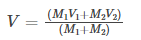

# AABB collision reaction theory

### Collision check between two AABBs
I have already been through the collision check theory and can check for a collision between two AABBs.  
See [the explanation here](Collision%20check%20theory.md)

## Collision reaction
### Definitions
- AABB  
    - Axis-aligned bounding box is just a rectangle collider with fixed rotation
    - I use this interchangably with bodies (game objects) and rectangles
- Vector magnitude
    - This is the size/length of a vector or it's hypotenuse
- Elastic collision
    - "An elastic collision is a collision in which there is no net loss in kinetic energy in the system as a result of the collision." [source](https://www.khanacademy.org/science/physics/linear-momentum/elastic-and-inelastic-collisions/a/what-are-elastic-and-inelastic-collisions)
    - Basically this means that the magnitude of the velocity before and after the collision of both AABB's will remain the same. There is no decrease in velocity
- Inelastic collision
    - "An inelastic collision is a collision in which there is a loss of kinetic energy."
    - Basically, some of the velocity is lost whether it be transferring to the other AABB or as heat or sound
    - For this we will ignore the energy being lost as another form, only the transferring between two bodies part
    
What do I mean by collision reaction?  
Basically when two AABBs collide, they have a velocity and that needs to change on a collision.  
Also, I need to push the objects out of each other as two AABBs should never be inside of each other, it doesnt' make sense.  
My goal here isn't to emulate reality entirely but get it to a kind of decent point with basic physics and maths.

### Inelastic collisions
In physics they talk about the transfer of energy but in this case we only care about kinetic energy so I will only refer to the transfer of velocity.  

So what we want is an inelastic collision between two bodies. This way if you had a red rectangle that is hardly moving and another green one that is coming in super fast, what should happen is that when they collide there should be a transfer of velocity.  
E.g.     
  
You can also think about a golf ball and a club. You swing your club and it gains a lot of velocity, then when it reaches the golf ball the velocity is transferred  

**Formula**  
According to [this website](https://byjus.com/physics/inelastic-collision/) and others, the formula is:  
  
Where  
V = final velocity vector  
M<sub>1</sub> = Mass of first body  
M<sub>2</sub> = Mass of second body  
V<sub>1</sub> = Initial velocity of first body  
V<sub>2</sub> = Initial velocity of second body  

In code this is
``` Javascript
let newVelocity = 
(ScalarMultiplyVec(mass1, velocity1) + ScalarMultiplyVec(mass2, velocity2))
/
(mass1+mass2)
```

### Push-out
Now that we have a new velocity, we need to push the objects out of each other respective to their velocities.